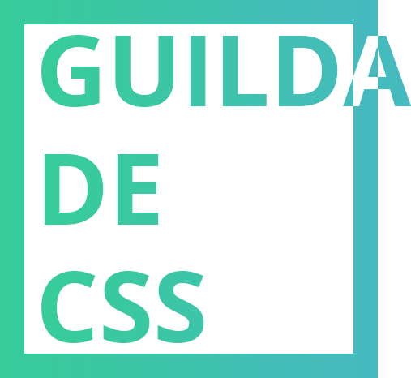

https://caveiratech.com/forum/cursos-e-books-tutoriais-apostilas-e-livros/udemy-aprendendo-svg-do-inicio-ao-avancado/

# Pagar.me CSS

:sparkles: Estudos sobre toda a magia do CSS

 

## Intro

O principal intuito é a troca de informação e o aprendizado dessa incógnita que todos temos medo.

## Cronograma
* [Introdução, história, onde aprender CSS, compatibilidade básica (caniuse.com)](/../../issues/1);
* Seletores (classe, id, avançados) e estados do elemento (active, focus, hover, visited);
* Box model (margin, border, padding, aba computed do devtools), valores e unidades (px, em, vh, vw);
* Display (block, inline, inline-block, flex, table), posicionamento (fixed, relative, absolute);
* Cores (hexadecimal, rgb, box-shadow, etc) e imagens (background-image);
* Tipografia (font-size, text-transform, text-shadow, importar, google fontes, etc);
* Pseudo elementos (before e after);
* Flexbox parte 1 (display, align-items, justify-content, layout básico);
* Flexbox parte 2 (avançado, layout avançado com flexbox);
* Grid (display grid: como usar e compatibilidade);
* Responsivo e fluído (media-queries);
* Animações (transform, key-frames, etc);
* SVG e font-icons;
* Herança e compatibilidade (IE, polyfills);
* Acessibilidade em CSS;
* Pré e pós processadores (Sass, Less, Stylus, PostCSS);
* Organização de CSS: Arquitetura e metodologia de CSS (SmacCSS, BemCSS, ITCSS, RsCSS, Atomic);
* Performance de CSS (aba perfomance do devtools, reflow);
* Futuro do CSS (cssnext).

## Regras

* Todos podem participar;
* Qualquer um pode submeter para um estudo e depois apresenta-lo e se for o caso, toda a apresentação deve tem um "tema de casa" para que os devs resolvam;
* Críticas, sugestões e qualquer coisa que melhore sempre será bem vinda!
* Teremos apenas uma aula por semana, totalizando 4 meses e meio de estudo CSS;
* Toda semana alguém apresenta na SEXTA-FEIRA no período da tarde sem restrição de hora e tempo;
* Deve tem link para o ZOOM para os remotos;
* Ao final de cada aula, será apresentado o próximo tópico e o "professor da aula";
* Todo o conteúdo será compartilhado com a comunidade e ficará exposto num project do codepen.io.
